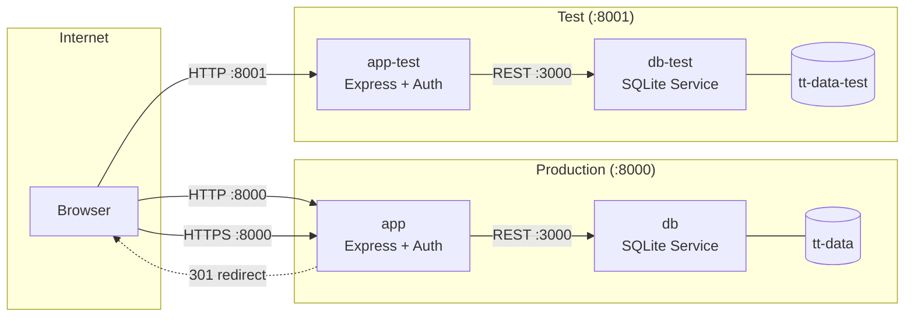
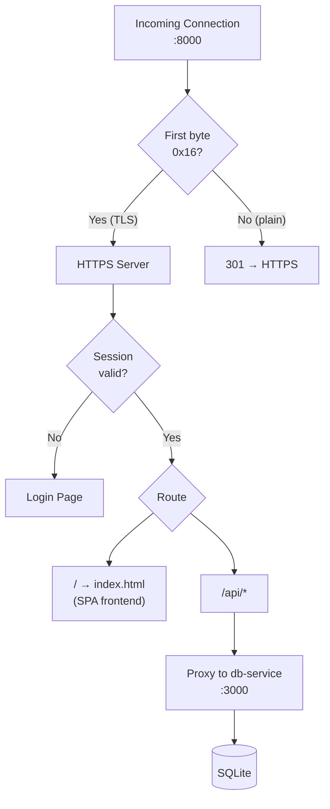

# TT Tracker

Table tennis match tracker with player stats, head-to-head records, and leaderboards.

## Architecture



### Request Flow



## Stack

- Node.js + Express + SQLite (better-sqlite3)
- Vanilla JS single-page frontend
- Docker Compose (prod + test instances)

## Run

```bash
npm install
ADMIN_PASS=yourpassword node server.js
```

Runs on `http://localhost:8000`.

Env vars: `ADMIN_USER` (default: admin), `ADMIN_PASS` (required), `PORT`, `DB_PATH`, `SESSION_SECRET`, `TLS_CERT`, `TLS_KEY`.

## Docker Compose

```bash
docker compose up --build -d
```

| Service | Port | Description |
|---------|------|-------------|
| app | 8000 | Production (HTTPS + HTTP redirect) |
| db | 3000 (internal) | Production SQLite service |
| app-test | 8001 | Test instance |
| db-test | 3000 (internal) | Test SQLite service |
