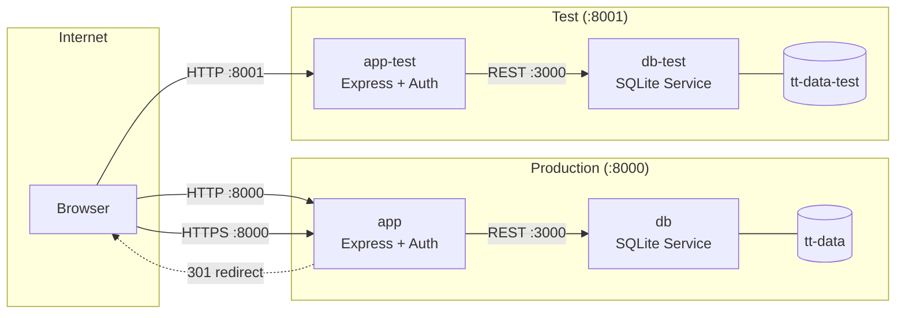
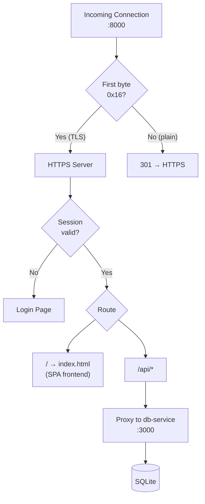

# TT Tracker

Table tennis match tracker with player stats, head-to-head records, and leaderboards.

## Architecture



### Request Flow



## Features

- **Match tracking** — log singles or doubles (2v2) matches with per-set scores, optional notes and location
- **ELO ratings** — automatic ELO rating system (K=32, start 1200) with full recalculation on match create/edit/delete
- **Player stats** — win/loss record, win rate, sets, points, recent form, streaks, head-to-head records
- **Charts** — SVG ELO progression and win rate over time charts per player
- **Season filtering** — filter stats by date range (all time, year, 3 months, 30 days)
- **Player comparison** — side-by-side stat comparison with H2H record and proportional bars
- **Leaderboard** — ranked by ELO, then win rate, then total wins with medal badges
- **Achievements** — 13 unlockable badges (win milestones, streaks, ELO, comeback king, clean sweep, rival)
- **Share cards** — download shareable match result cards as PNG images
- **Comments** — comment section on each match
- **Locations** — venue management with GPS auto-detect and image upload
- **Multi-language** — English and German
- **Offline support** — log matches offline, sync when back online
- **Data export** — CSV and JSON export
- **PWA** — installable progressive web app with dark mode

## Stack

- Node.js + Express + SQLite (better-sqlite3)
- Vanilla JS single-page frontend
- Docker Compose (prod + test instances)

## User Accounts

Two roles: **admin** (full access including delete and user management) and **user** (can log matches and view stats, cannot delete).

On first startup, the admin account is seeded from `ADMIN_USER`/`ADMIN_PASS` env vars. After that, admins manage users through the UI (gear icon in the header). `ADMIN_PASS` is only required when no users exist yet.

## Run

```bash
npm install
ADMIN_PASS=yourpassword node server.js
```

Runs on `http://localhost:8000`. The build version (git SHA) is shown in the header when built with `--build-arg BUILD_SHA=<hash>`.

| Variable | Default | Description |
|----------|---------|-------------|
| `ADMIN_USER` | `admin` | Initial admin username (bootstrap only) |
| `ADMIN_PASS` | — | Initial admin password (required on first run) |
| `SESSION_SECRET` | random | Session encryption key |
| `DB_URL` | `http://db:3000` | db-service URL |
| `DB_TOKEN` | — | Shared auth token between app and db-service |
| `PORT` | `8000` | Server port |
| `BUILD_SHA` | `dev` | Git commit hash shown in UI header |
| `TLS_CERT` | — | Path to TLS certificate (enables HTTPS) |
| `TLS_KEY` | — | Path to TLS private key |

## Docker Compose

```bash
docker compose up --build -d
```

| Service | Port | Description |
|---------|------|-------------|
| app | 8000 | Production (HTTPS + HTTP redirect) |
| db | 3000 (internal) | Production SQLite service |
| app-test | 8001 | Test instance |
| db-test | 3000 (internal) | Test SQLite service |
